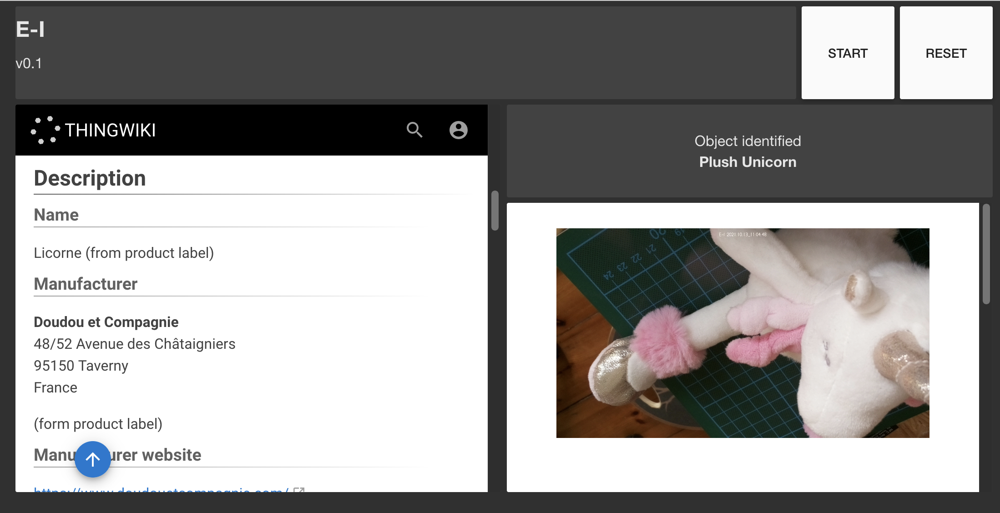

# 2.1 (D10) Technology Demonstrators

> This deliverable will be an output of T2.1, in which ESRs work with OFFINN to develop a deeper understanding of specific open prototyping technology that is applicable to their chosen domain (e.g. IoT-capable Arduinos, Mozilla Voice, Raspberry Pi).
> Documentation will take the form of source code, files for digital fabrication, videos, Instructables, etc., as appropriate.

The training on Open Hardware provided by Officine Innesto happened in two stages. The first one was an overview of what can be accomplished with open source hardware, whilst the second was hands-on and focused on turning the research concepts into prototypes. This second part took place about the same time as I was conducting the workshops of the [reuse.city co-design lab](../D13_deployment-datasets/reuse-city). Such a timeframe proved perfect, as I was able to discuss improvements to the concept ideas with participants of the lab at the same time as I would learn and experiment about the possibilities and limits of current technologies.

The technology demonstrators in this folder are modules that can be assembled to build a prototype named "E-I", short for "evaluation interface". The [concept idea](../D11_co-designed-concepts) in which E-I is based sees it taking different shapes: an app for mobile devices, a workbench machine, or a larger kiosk form-factor to be deployed in public spaces. Its user would present different objects to be assessed by E-I, whose screen would then display information about the value and potential of reuse of said objects.

E-I is a speculative device, which relies both on the availability of trusted data and on its own ability to recognise objects. Neither is universally feasible as of yet. For prototyping purposes, though, the features of E-I can be simulated with a limited set of objects.

The [prototype](../D12_documentation-of-prototypes) the demonstrators on this folder relate to is the workbench version. It is composed of an articulated arm with a camera. Some sensors and a touchscreen display attached to a Raspberry Pi provide the desired functionality.

This folder consists of the following:

 - [doc.md](doc.md): Technical documentation of the modules.
 - [E-I_NFC](E-I_NFC): Arduino code to recognise NFC tags using a GROVE NFC module, and send their identifiers via USB to the Raspberry Pi.
 - [E-I_node](E-I_NFC): Node-RED flows in JSON format that will:
    - Display on the machine the image that is captured by the camera;
    - Receive the identifiers from the NFC sensor when the object's NFC tags are recognised;
    - Display different information on a web page each time a different NFC tag is recognised.
 - [notes.md](notes.md): Notes made while developing and improving the demonstrators and prototype.
 - [references.md](references.md): Further references about the hardware and software used for the prototype.

The Node-RED flows included here serve a dashboard that embeds the contents of a web page for each object. As the prototyping phase progressed, it was decided to use a separate website for that purpose, whose documentation can be found on [the proper folder](../D12_documentation-of-prototypes/thingwiki).
