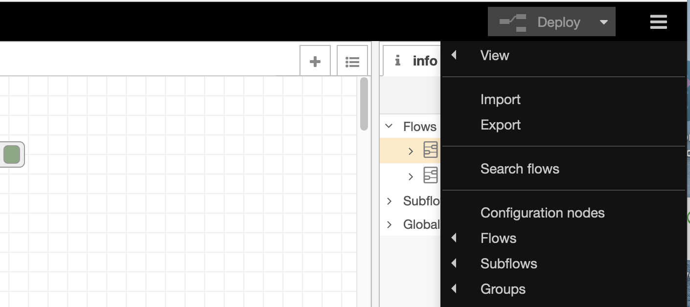

# Documentation

How to replicate the experiments on this folder.

## 1. Hardware

### 1.1. Hardware list

 - [Arduino MKR 1010 Board](https://web.archive.org/web/20211011134406/https://docs.arduino.cc/hardware/mkr-wifi-1010/) + [MKR Connector Carrier](https://web.archive.org/web/20211011134727/https://docs.arduino.cc/hardware/mkr-connector-carrier/)
 - [Grove Ultrasonic Ranger](https://web.archive.org/web/20210505093856/https://wiki.seeedstudio.com/Grove-Ultrasonic_Ranger/).
 - [Grove NFC](https://web.archive.org/web/20210118105822/https://wiki.seeedstudio.com/Grove_NFC/)).
 - Raspberry Pi 4b.
 - Pi Camera.
 - Extension cable for the camera.

### 1.2. Hardware connections

 1. Connect the NFC Antenna to Grove NFC.
 1. Connect Grove NFC to the SERIAL connector on the MKR Carrier.
 1. Attach the MKR 1010 to the MKR carrier.
 1. (to upload code to the board) connect MKR 1010 via USB to the computer that will run the Arduino IDE.
 1. (after uploading code) connect the MKR 1010 via USB to the Raspberry Pi.

## 2. Software

### 2.1. Arduino

#### Preparation

 1. Install the [Arduino IDE](https://web.archive.org/web/20211006233325/https://www.arduino.cc/en/Guide).
 1. Open the Arduino IDE, click on Tools > Board Manager > Manage Boards and search "MKR". Install the package _Arduino SAMD Boards_.
 1. [Download](https://github.com/vongomben/fluid-networks/raw/master/Libraries/NFC.zip) and [install](https://web.archive.org/web/20210118105822/https://wiki.seeedstudio.com/Grove_NFC/) the NFC library for Arduino.

#### Install code

 1. Open the file [E-I_NFC.ino](../E-I_NFC/E-I_NFC.ino) in the Arduino IDE. Edit the strings with the NFG identifiers (lines 105, 111, 117). Test the code and upload it to the board.
 1. After installing, disconnect the MKR1010 board from the computer with the Arduino IDE. Connect the MKR1010 to the Raspberry Pi via USB.

### 2.2. Raspberry Pi OS

 1. Download and install the [latest version of Raspberry Pi OS](https://web.archive.org/web/20211010224609/https://www.raspberrypi.com/software/).

### 2.3. Node-RED

#### Preparation

 1. [Install node-RED in the Raspberry Pi](https://web.archive.org/web/20210722184839/https://nodered.org/docs/getting-started/raspberrypi).

#### Install code

 1. Download the file [E-I_node.json](../E-I_node/E-I_node.json) to your computer.
 1. Open the node-RED editor on a browser, click on the menu icon (top right), then "Import" and find the json file on your computer.
 
 1. Change variables as needed and click the "Deploy" button.
 
