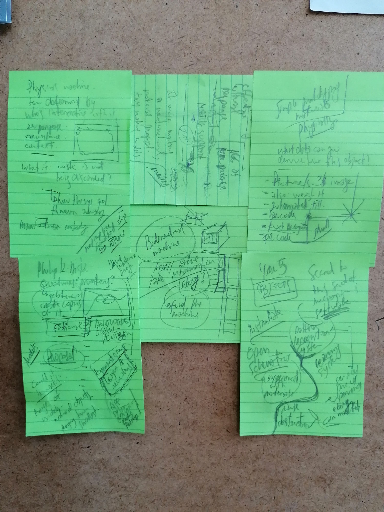

# 2.2 (D11) Co-Designed IoT Concepts 2

> This deliverable will be an output from T2.2, in which ESRs will continue to co-design concepts from WP1 based on an increasing understanding of the social and technical space. The deliverable will comprise a series of design concepts, co-designed with audiences, illustrated through notes, sketches, videos and low fidelity prototypes.

The meetings and other online activities conducted through the [reuse.city co-design lab](../D13_deployment-datasets/reuse-city) offered the opportunity to update and refine two of the [concept ideas](https://is.efeefe.me/concepts) developed on the first year of research: the [universal registry of things](https://is.efeefe.me/concepts/universal-registry-things) and the [transformation labs](https://is.efeefe.me/concepts/transformation-lab). A third concept called evaluation interface emerged from iterating discussions over the original concept called [point and reuse](https://is.efeefe.me/concepts/point-reuse).

This folder contains documentation about the updated concept ideas, resulting from experimentation and reflection, as well as discussions with colleagues, supervisors, consortium partners and the public of events such as Mozfest 2021.

- [e-i](e-i).
- [transformation labs](transformation-labs).
- [universal registry of things](universal-registry).
- [brainstorming of names](naming.md) for different elements of the project.
