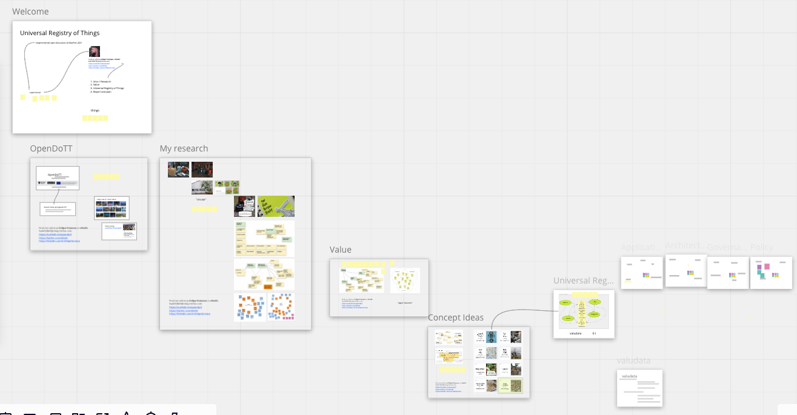

# Universal Registry of Things

The Universal Registry of Things is a trusted source of information about how to reuse objects and materials. It offers information about repair, customisation and repurposing of virtually any good or material.

## 1. Background

The [original concept for the Universal Registry of Things](https://web.archive.org/web/*/https://is.efeefe.me/concepts/universal-registry-things) was created as an outcome of the first year of activities in the OpenDoTT project.

## 2. Updated concept

The Universal Registry of Things is a dynamic source for information about the value and reusability of goods and materials. It connects constantly to third-party datasources and uses AI to normalise them and make them available through open protocols.

Data for the Universal Registry of Things is provided by manufacturers, associations, repair professionals, community groups, artists and other stakeholders. It comprises of objective specifications, descriptions and links to online resources as well as stories and subjective accounts on the reuse of things. Its deployment and use is promoted by initiatives related to zero waste, circular economy and the right to repair. There are commons-based mechanisms to validate and solve disputes over data.

### 2.1. Process

During the second year, the concept evolved based on diverse activities:

 - Conversations with colleagues, supervisors and consortium members;
 - Leading a workshop during Mozfest 2021 ([see below](#Mozfest-2021));
 - Organising and running the reuse-city online co-design lab (see documentation on the [deployment dataset](../../D13_deployment-datasets/reuse-city)).

A prototype of the Universal Registry of Things was developed and called "thingwiki" (see documentation [here](../../D12_documentation-of-prototypes)).

### 2.2. Mozfest 2021

A workshop about the Universal Registry of Things was part of the program for Mozfest 2021. The plan was to engage with participants familiarised with AI and data science to understand the feasibility of the concept. Other goals of the activity were to discuss the meaning of value and its implications in designing information systems, as well as to recruit participants for later stages of research.

More about the session:

 - Workshop [application](mozfest-application.md) and [overview](mozfest.md)
 - [Preparation blog post](mozfest-preparation_blog-post.md)
 - [Session notes](mozfest-session-notes.md).

Leading that session, as well as attending other activities of Mozfest, was a goood opportunity to rehearse and reflect on what I would develop later in the year, particularly the reuse city online co-design lab. The objective of having a relevant conversation around the idea of value was accomplished. The discussions did not go too deep into technical questions, however the topic of data governance emerged at some points. Finally, some participants signed up for future activities (P.S.: at least two of them took part on reuse.city one  month later).

## 3. References

## 3.1. Instructables

> The seeds of Instructables germinated at the MIT Media Lab as the future founders of Squid Labs built places to share their projects, connect with others, and make an impact on the world. One of these early places was a blog Zeroprestige, which was an open source hardware experiment for kitesurfing. Here they documented their hand-sewn kites, plywood boards, and other general mayhem that happens when PhDs and high winds collide.
> As a result of freely sharing our work, we met a ton of great people, received great opportunities, and were smacked in the face with the need for a web-based documentation system.
> Instructables became that documentation system in 2005, as an in-house project of Squid Labs. When they weren't solving interesting problems like solar panels for driveways, efficiently harnessing human power, or strain sensing ropes, you could find them sharing Instructables from the workshop. From cooking to 3d printing, to making just about anything fly, Instructables became the recipient of countless hours of tinkering, soldering, stitching, frying, and fun, making just about anything.
> Instructables was officially spun out of Squid Labs in the summer of 2006, and has gone on to grow from a modest hundreds of projects to over one hundred thousand. The community that now calls the site home, is an amazing mix of wonder from around the world. Every day we continue to be amazed by the imagination, curiosity, and simple awesomeness of everyone who shares their creations with us on Instructables.

[https://www.instructables.com/](https://www.instructables.com/) / [web archive](https://web.archive.org/web/20210616034816/https://www.instructables.com/)

## 3.2. ThinkWiki

> This is ThinkWiki, the Wikipedia for IBM and Lenovo ThinkPad users. In here, you can find anything you need to install your favourite Linux distribution on your ThinkPad. Windows users shouldn't run away, there's a lot of useful information for them as well. Some Linux information for Mac users also can be found here.

 - [http://thinkwiki.org/](http://thinkwiki.org/) / [web archive](https://web.archive.org/web/20210515150512/http://www.thinkwiki.org/wiki/)

## 3.3. Thingiverse

> MakerBot's Thingiverse is a thriving design community for discovering, making, and sharing 3D printable things. As the world's largest 3D printing community, we believe that everyone should be encouraged to create and remix 3D things, no matter their technical expertise or previous experience. In the spirit of maintaining an open platform, all designs are encouraged to be licensed under a Creative Commons license, meaning that anyone can use or alter any design.

 - [https://www.thingiverse.com/](https://www.thingiverse.com/) / [web archive](https://web.archive.org/web/20210617150215/https://www.thingiverse.com/)

## 3.4. Open Repair Data Standard

> The Open Repair Data Standard (ORDS) defines a shared approach towards collecting and sharing repair data about small electricals and electronics. The goal of this standard is to make it easy to combine open data on electronics repair that has been collected by many different groups.

 - [https://openrepair.org/open-data/open-standard/](https://openrepair.org/open-data/open-standard/) / [web archive](https://web.archive.org/web/20210226093415/https://openrepair.org/open-data/open-standard/)

## 3.5. Open3R

> This household waste recycling centre (HWRC) open data standard is a standard which describes information about HWRCs, and is being designed to provide guidance to local authorities on publishing data about HWRCs. Data such as opening times, the services that are offered by a HWRC A data standard makes data better for users, because it means that different publishers, with different data capture and publishing systems, can publish data in the same format. This means it is much easier to stick two publisher's datasets together. If everyone publishes their data to the standard, then it is theoretically possible to have a dataset that covers the whole of the UK. This dataset could then be used to power a Where's My Nearest Recycling Centre app, or support time-to-travel analyses for recycling centres.

 - [https://github.com/DsposalTom/Open3R](https://github.com/DsposalTom/Open3R)

## 3.6. Persistent Things

> Self-sovereign Matter proposes the design of objects that have an inherent disposition to persevere, encouraging the creation of repair economies. To achieve this, objects could be self-executing—using smart contracts and IoT technologies, objects could self-monitor their performance and send notifications when in need of repair, creating a demand and incentivising hacking and repairing. At a second level, products could be self-owning; that is, the decision to be hacked, repaired, adapted or reused belongs to the object and cannot be overwritten by the economic interests of other actors in the production system.

 - [https://www.climate-kic.org/opinion/persistent-things/](https://www.climate-kic.org/opinion/persistent-things/) / [web archive](https://web.archive.org/web/20210118061611/https://www.climate-kic.org/opinion/persistent-things/)

## 3.7. WasteNet

> [T]he world’s largest dataset for waste, holding over 2.5 million training images created by deep learning and computer vision.
These datasets are refined by weight and brand-level detection enabled through [Recycleye’s vision system](https://recycleye.com/artificial-intelligence-total-waste/).

 - [https://recycleye.com/wastenet-2/](https://recycleye.com/wastenet-2/) / [web archive](https://web.archive.org/web/20210615121437/https://recycleye.com/wastenet-2/)

## 3.8. Data Europa: "Waste"

> Query search for "waste" in the european data portal.

 - [https://data.europa.eu/data/datasets?query=waste&locale=en&minScoring=0](https://data.europa.eu/data/datasets?query=waste&locale=en&minScoring=0)

## 3.9. Selecting a data sharing structure: a value-based choice

 - [https://datatrusts.uk/blogs/selectingdatastructures](https://datatrusts.uk/blogs/selectingdatastructures) / [web archive](https://web.archive.org/web/20201126191404/https://datatrusts.uk/blogs/selectingdatastructures)

## 3.10. Manifesto in favour of technological sovereignty and digital rights for cities

 - [https://www.barcelona.cat/digitalstandards/manifesto/0.2/](https://www.barcelona.cat/digitalstandards/manifesto/0.2/) / [web archive](https://web.archive.org/web/20201118173333/https://www.barcelona.cat/digitalstandards/manifesto/0.2/)

## 3.11. The Data Spectrum

  - https://theodi.org/about-the-odi/the-data-spectrum/

## 3.12. Dublin Core

  - https://dublincore.org/specifications/dublin-core

## 3.13. Fixfirst

 - https://www.fixfirst.de/

## 3.14. Other references

### "Our Waste Taxonomy"

