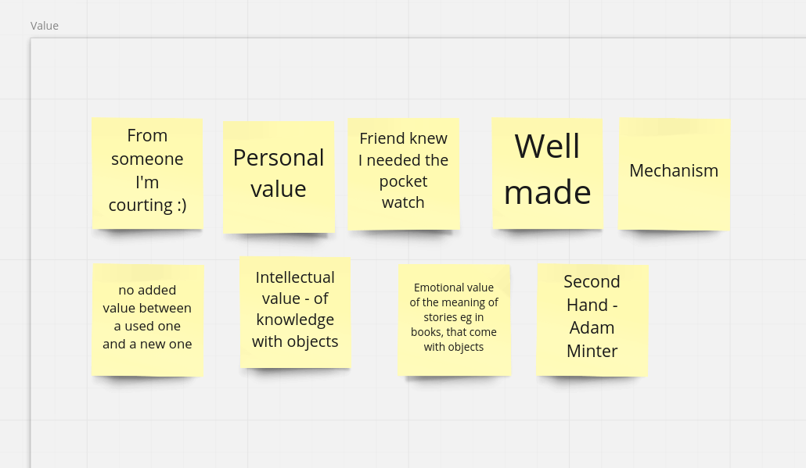
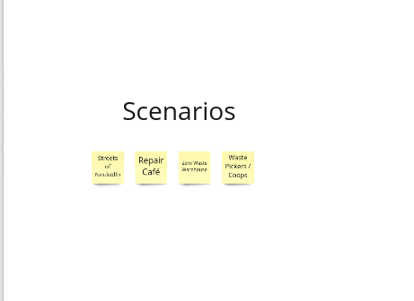
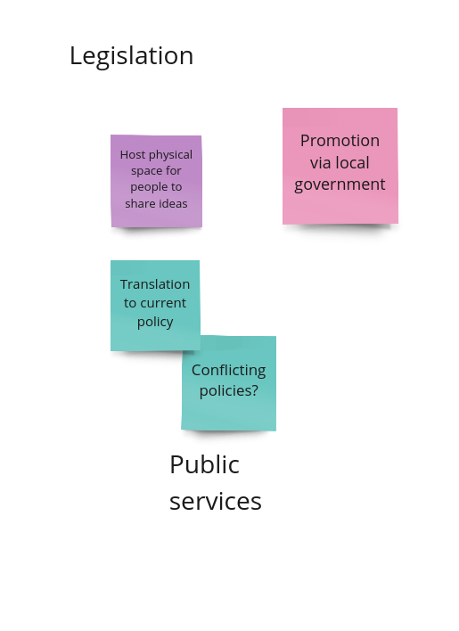

# Intro Script

> Whilst preparing for the session at mozfest, I decided to organise how I would introduce my plans for the day. Instead of using post-it notes only, it made sense to write down this introduction and make it available as a sort of meta-documentation. I eventually skipped some of the following points, but decided to keep all of them in the repository:

Preliminary notes for my session at MozFest

* Hi. I am Felipe Fonseca. Brazilian activist turned researcher.
* I'm not known to strictly adhering to predefined formats, and will invite you all to experiment a bit today.
* This session was proposed as a "discussion", and that still is what I hope to promote today. But you may have noticed that I'm the only proponent.
* My plan is to get all of you involved in an open discussion starting today and extending into the future.
* In preparing for this session, I was trying to balance my expectations. Even if a significant part of the audience was composed of people whose work I already know and follow, I still would want to encourage others to join in.
* As I hope to demonstrate, the main topic of my research should not be discussed exclusively by "experts". I like to think I am working on a theme that is relatable to a lot of people.

* My attempt at facilitating this discussion is itself an experiment. Instead of going through a set of slides and later asking you all to contribute against a limited set of questions, I want to invite all of you to join a Miro board (posting link to the chat) right now.

* I have set it up in such a way that I can use it as a map for this presentation. For that, I will share my screen here. But you are all invited to add comments, images, post-it notes or anything else you may find relevant, at any time you feel like it.

* One note I must make right now: this Miro board is not one of Mozilla's. I am using my student account to access some more advanced features. You may expect me in any case to adhere to the MozFest guidelines pertaining data protection. In other words: at this point I will not use any personal information you may share here. A snapshot of the board may be included in the open repository I am using to document my research, but even in that case I will first strip any personal information out of it.

* This session will not be enough to cover everything I did in the last 18 months of research. I will go very briefly, but again let me know if you need clarification at any point. My plan is to have four moments today:

1. Introduction to this session and my research
1. Value - what does it mean?
1. Concept ideas - universal registry of things / group Discussion
1. Report and plan ahead

* As I mentioned, you may add your notes anywhere, anytime.

* Towards the end of this session I will extend an invitation to join future research activities, in the form of a series of co-design workshops that will go deeper into some of the topics I'll touch upon today. If for any reason you have to leave before the end, feel free to contact me via social media or email so we can keep in touch.

## Why MozFest?

My interests here today:

- Data Stewardship
- Free / open source
- Ethical approach to technology
- Trustworthy AI
- Policy

## Let's think about things

* I believe at this point of MozFest some of you may already be tired of introducing yourselves. I will start by making a question, and ask that those of you who feel like replying to do so, and if desired to introduce yourselves. I would only ask that we don't extend this first part after 15 minutes into the session (which means X minutes from now) so we can go on. You can also use the chat to reply, or post comments, images or links on Miro.

The question is: what was the last second-hand object you have acquired? It can be something you got from a friend or relative, that you bought off a thrift shop or ebay, or even something you found in the street.

# Session

After the introduction and prompt above, some participants shared quick stories about things they had gotten recently. It felt like a good start for a discussion aiming at discussing the value of material objects.

The rest of the session followed the Miro board I had prepared beforehand. I described what OpenDoTT is and what drew me to apply to join it; my critical take on smart cities since early on; the decision to focus on waste and reuse; the research studies I performed in the first year of research. We then had an interesting open discussion about value. Following that I described briefly my concept ideas, with a special focus on my long term aspirations pertaining the [reuse commons](https://is.efeefe.me/admin/pages/concepts/reuse-commons).

Then I brought the focus back to my plans for this year (prototyping) and this session (the universal registry of things), and opened 4 break-out rooms: applications; architecture; governance; policy. It was my first time doing that, and I had not foreseen what happened next: about half the people participating in the session disappeared.

I should have expected that, as I also do that a lot. Unlike in a face-to-face workshop, where the shy ones are strongly encouraged (or softly forced) to join discussions in smaller groups, in a zoom call it is all too easy to just drop out and focus on other stuff.

It may also have to do with my inability to encourage participation with clearer prompts and questions. And to the fact that I had expected more acquaintances to be present and active in the break-out groups. Adding to all that, exactly in that part of the session I was unfortunately distracted by things happening at home (a package arrived, the delivery guy wanted to complain to an adult that my name was not on the buzzer downstairs, my ten year old got anxious with that situation and came to ask for help). But I won't blame the delivery guy for the outcomes of the break-out rooms.

Still a little disappointed with all that, I resumed the main discussion but felt I needed to rush into talking about future plans and inviting people to follow up before our 60 minutes were gone, and for that reason may have discouraged fruitful discussions that could have taken place. Even then, there was an interesting exchange with some participants that was subsequently carried to the sustainability room at spatial chat.

My observation now: it's hard to prepare for a session without a clue of who's really joining. I'm not at all comfortable with this semi-anonymous format and hope that coming phases of my research can get participants involved in a more organic way. On the other hand, it was a good exercise of avoiding a mere slideshow and opening up for different ways for people to interact. I think I'll repeat that in my future workshops. And finally, I was happy to have had a "live" conversation with one particular person I have interacted with exclusively via email for well over a decade.

I thank Mozilla and MozFest for organising this ambitious event. Really glad to be engaging somehow with the wider community, albeit in this online version that lacks so much.

# PS

More observations, some days after the session, sent to my academic supervisors:

- Pros: Access to people I hadn't met before. The discussion about value was interesting to confirm the relevance of some of my concept ideas (some participants suggested ideas that are already covered on my concepts). Two participants signed up to learn more about future plans. From my end, preparing for the session was also useful as a way to organise the narrative for this phase. I used a miro board as a guideline for the presentation, which allowed people to post comments even while I was talking. Also, my connection was relatively good (I turned my kids' devices wifi off ;)).
- Cons: I figure it's hard to prepare for a session without a clue of who's joining, and at the same time not being able to rely that much on eye-to-eye improvisation. Last April when I organised that first open session introducing the repair diaries I felt more in control of everything. The three people whom I counted on to help facilitate simply didn't show up (I don't blame them, mozfest unfortunately does not integrate easily with google calendar, and I have missed some sessions myself). Additionally, the original plan was that my kids would be at a friend's, but that morning the friend informed me he had to self isolate as a close family member tested positive for COVID. And finally, exactly at the point where I was directing participants to the break-out groups, the stupid delivery person bringing my new modem was insisting on the buzzer and asked my daughter to call me, only to complain about something. I think I missed some participants there, but by observing my own behaviour in other sessions I'd say a number of drop-outs when the sessions turn interactive were to be expected anyway.
