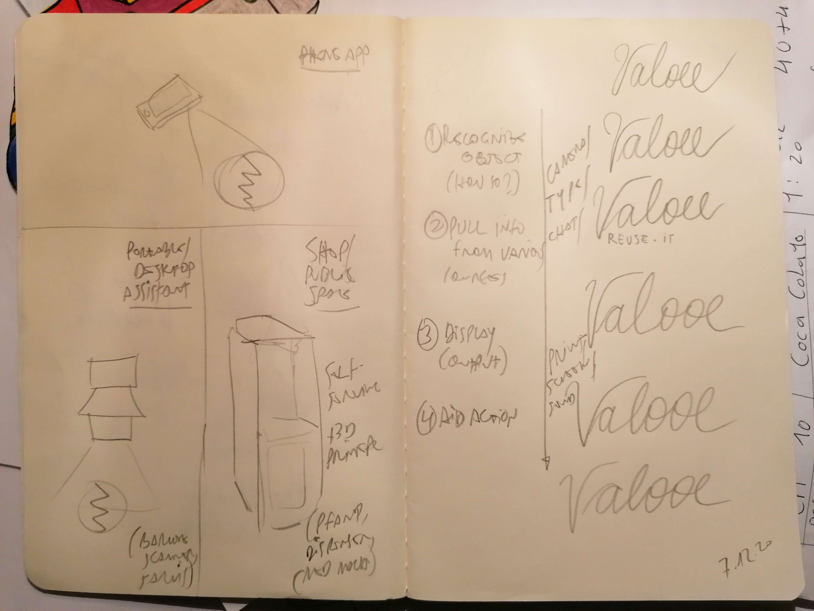
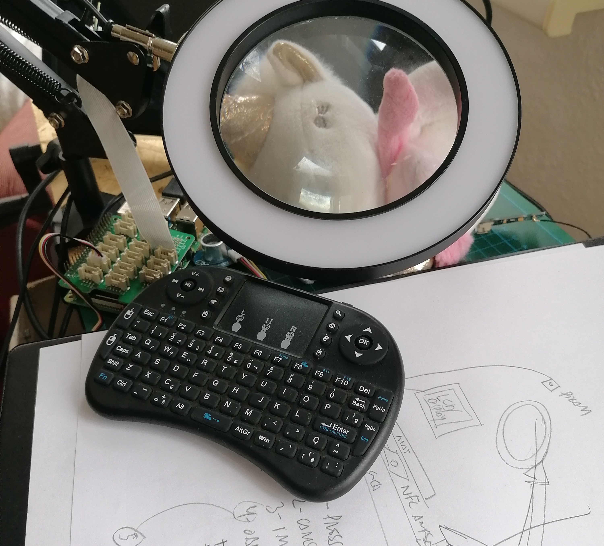
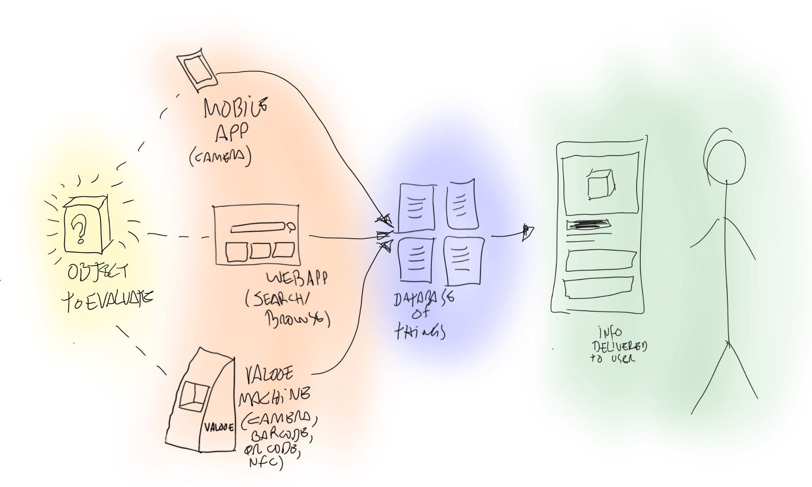

# E-I - evaluation interface

## Concept

**E-I**, short for Evaluation Interface, is a combination of speculative technologies conceived to help society reuse discarded materials.

Its main purpose is allowing users to assess the potential value of materials.
E-I does that by identifying objects and parsing them against an open database with information relevant for evaluating and reusing said objects.

E-I can be deployed in different form factors: an app for mobile devices; a workbench equipment; or even a larger version shaped as a kiosk or vending machine.

For the purposes of research prototyping, the workbench version was chosen.

Original concept:  [Point and Reuse](https://is.efeefe.me/concepts/point-reuse), created in previous phases of research.

## Features

The expected behaviour of the workbench version of E-I is designed around the steps below:

 1. The user asks E-I about a specific object in one of the following ways:
placing the object on E-I
  - typing a search query into a keyboard in its touchscreen, or
  - asking E-I about the object.
 2. E-I compares images and other information collected from the product/object (weight, colors, barcode, QR code) against an open database of things
 3. When information about the object is found, E-I retrieves it and delivers to the user via screen or voice.
 4. When information about the object is not found, E-I allows the user to input it via keyboard or voice.

## Prototyping

The speculative prototype of E-I consists of the following:

 - An articulated arm is attached to a workbench with a cutting mat.
 - A proximity sensor (ultrasonic), a NFC reader, a video camera and a touch screen are attached to a Raspberry Pi.
 - When an object is put in the mat, the screen turns on. The image of the object is shown in a window.
 - Some predefined objects have a NFC tag. When these are recognised, the screen shows information about then.
 - When the object is not identified, the user can press a button and input information about it.

## Sketch #1

**Expected behaviour:**

## This prototype

The goal of this prototype is not to develop a functional product, but experiment with speculative use cases. The idea is to devise technologies that might promote the reuse of a larger proportion of goods and materials.

Other points of discussion are what would the implications of such technologies be in terms of use, privacy, health and safety, policy and economy.

