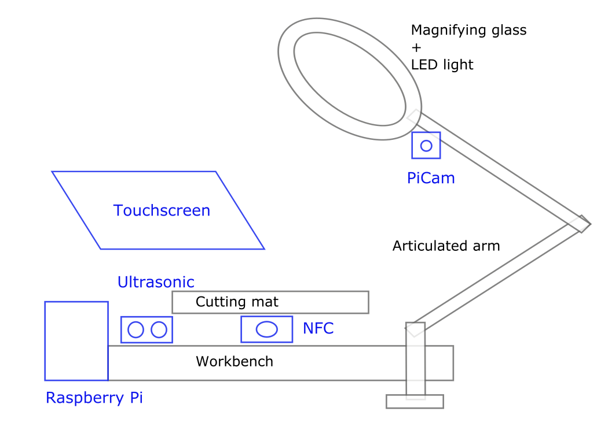
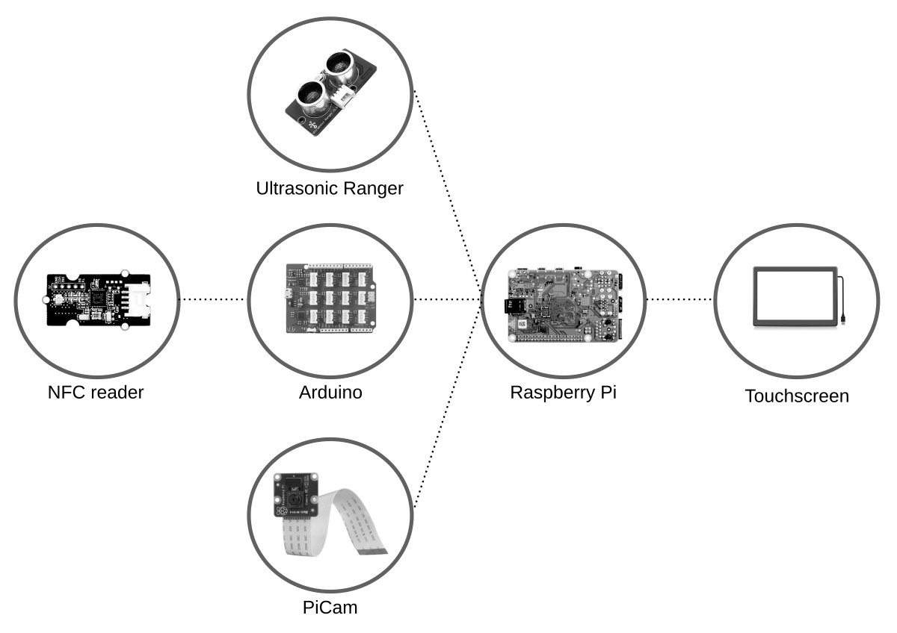
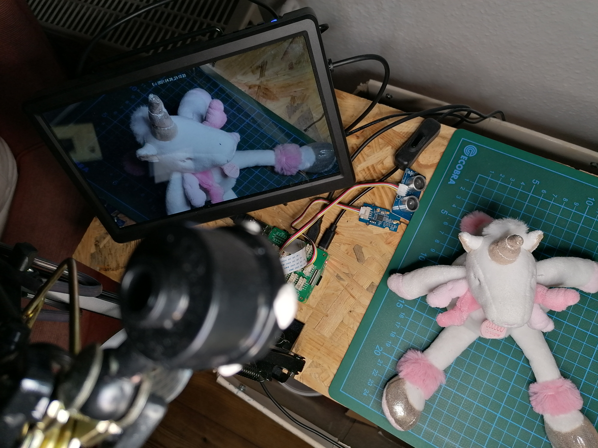

# E-I - evaluation interface

## Concept

**E-I**, short for Evaluation Interface, is a combination of speculative technologies creted to help cities reuse discarded materials. The concept idea can be found [here](../../D11_co-designed-concepts/e-i).

E-I can be deployed in different form factors: an app for mobile devices; a workbench equipment; or even a larger version shaped as a kiosk or vending machine. For the purposes of research prototyping, the workbench version was chosen.

## Prototyping

The speculative prototype of E-I consists of the following:

 - An articulated arm is attached to a workbench with a cutting mat.
 - A NFC reader, a video camera and a touch screen are attached to a Raspberry Pi. Optionally, an ultrasonic ranger (proximity sensor) can be used to turn the screen on automatically.
 - When an object is put in the mat, the image of the object is shown in a window.
 - Some predefined objects have a NFC tag. When these are recognised, the screen shows information about them.
 - When the object is not identified, the user can press a button and input information about it.

## Hardware

The E-I prototype uses an ultrasonic sensor, NFC reader, arduino board, pi camera, raspberry Pi and a touch screen.

## Software

The NFC reader is attached to the arduino board and sends its readings via USB to the Raspberry Pi running the Debian based Raspberry Pi OS.

The Raspberry Pi board has node-red running locally, to which the camera and the ultrasonic sensor are connected. It displays information using the node-red dashboard module.

All the software needed to put the prototype to work can be found in [this folder](../../D10_technology-demonstrators).

## This prototype

The goal of this prototype is not to develop a functional product, but experiment with speculative use cases. The idea is to devise technologies that might promote the reuse of a larger proportion of goods and materials.

Other points of discussion are the potential implications of such technologies in terms of use, privacy, health and safety, policy and economy.

I kept some notes while [brainstorming](brainstorming.md) for this prototype. I had the intention of making a speculative [video](video.md), but unfortunately the timing did not work.

