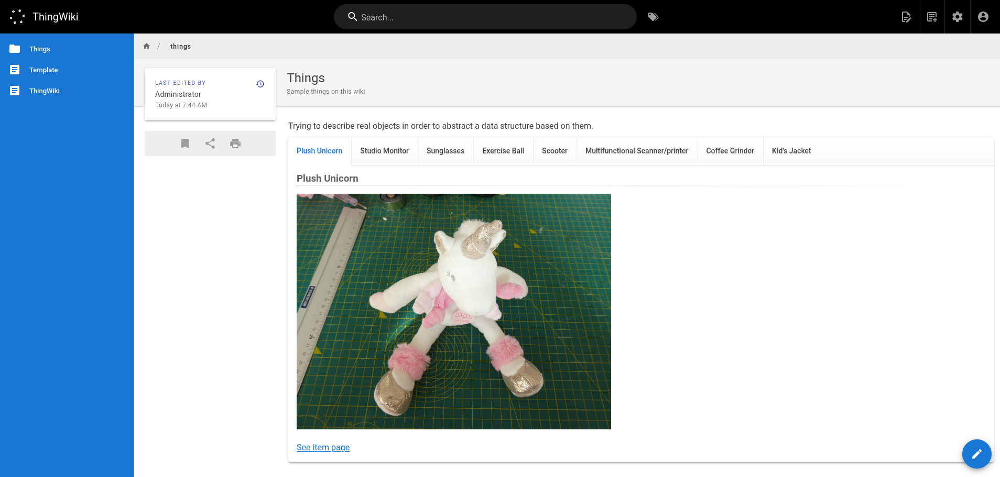
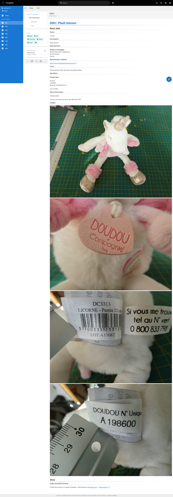

# ThingWiki

ThingWiki is a prototype of the concept idea "[Universal Registry of Things](../D11_co-designed-concepts/universal-registry)". It consists of a website built with the Wiki.js content management system. Information about things is stored based on a standard [template](#template). All the data is synchronized with a public [git repository](https://github.com/reuse-city/thingwiki) that allows data to be reused and incorporated in other services.



The prototype can be tested [live[(https://thingwiki.cc/)] ([snapshots on the internet archive](https://web.archive.org/web/*/https://thingwiki.cc/)). Complete technical documentation on how to set up a copy of the website can be found [here](replicate.md).



## Points of discussion

- Architecture / data structure and exchange
- Applications / Interface
- Governance / stewardship
- Policy and legislation

## Further references

- [Open3R](https://github.com/OpenDataManchester/Open3R) - A data standard for reporting data about Household Waste Recycling Centres
- [Dublin Core](https://dublincore.org/specifications/dublin-core/)

See also [benchmarking.md](benchmarking.md) for examples of similar or otherwise inspiring projects.

## Template

As of October 2021, the working template for ThingWiki consists of the following fields:

```
# 0001: Title

## Basic data

### Name

### Description

### Manufacturer

### Manufacturer website

### Color

### Identifiers

### More information

### Images

## Stories

### Author

```

### Previous discussion

*Notes about the template are documented on [this file](fields.md)*.

Some examples of types of data to be featured:

* Manufacturer, support and end-of-life policy;
* Versions and official recalls;
* Price of object offered online (new/used);
* Materials and service manuals;
* Parts and Repair tools;
* Tutorials of repair;
* Examples of reuse / upcycling;
* Second-hand market information.

Examples of products to be featured in the prototype:

* Laptop
* Bicycle
* Guitar
