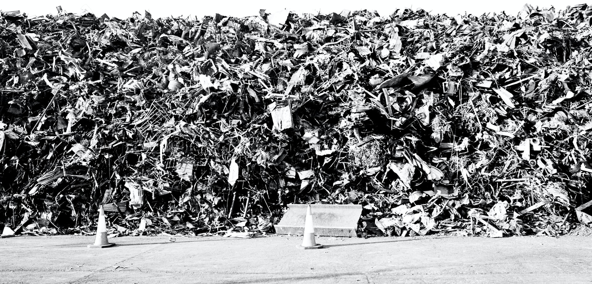

# reuse.city

Hi, and welcome to reuse.city. I am [Felipe Schmidt Fonseca](https://is.efeefe.me), a PhD researcher in the [OpenDoTT project](https://opendott.org) (Northumbria University / Mozilla Foundation). My current [research questions](https://is.efeefe.me/opendott/questions) revolve around waste prevention through practices of reuse. Learn more about my research [here](../opendott).

This page holds the ongoing documentation of my current efforts to co-design and prototype technologies and other ways to help assess the potential value of discarded materials. It will be updated in tandem with meta-documentation on [my second year of research](https://github.com/opendott-smartcities/II/).

## Online co-design lab

I have recently recruited participants to join a series of activities during four weeks in April 2021. I have used [this repository](https://github.com/reuse-city/lab/) to document the process, insights and findings. I have also set up communication channels with the participants that will soon be opened up for participants. And I intend to use this [twitter profile](https://twitter.com/reuse_city) to post updates in the future. At some point I will also update the [hotsite](https://make.reuse.city) with meaningful contents, inspired by my research activities.