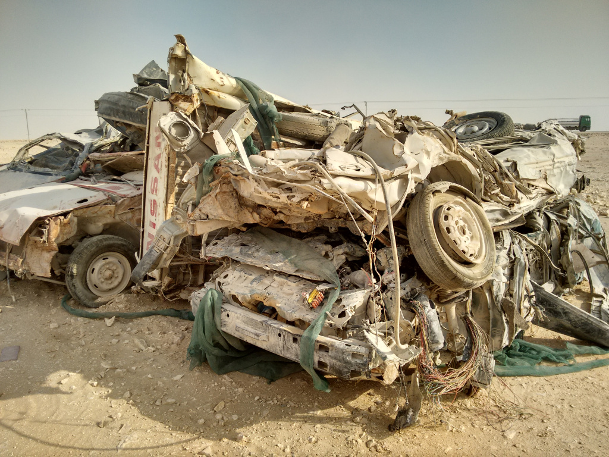
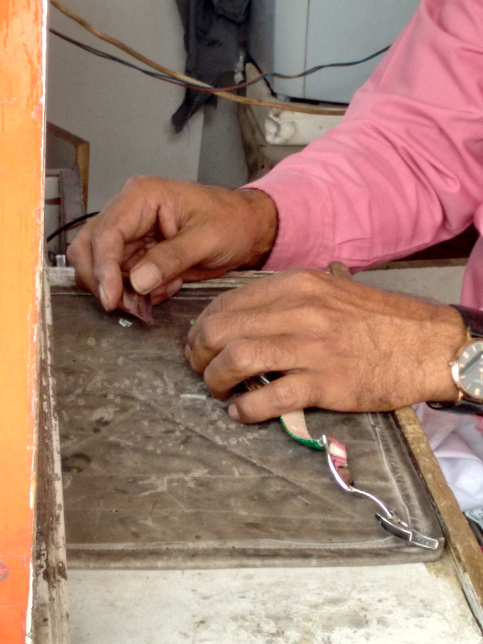
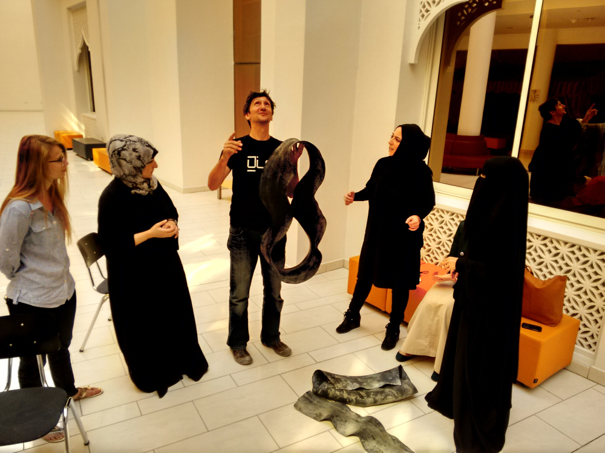
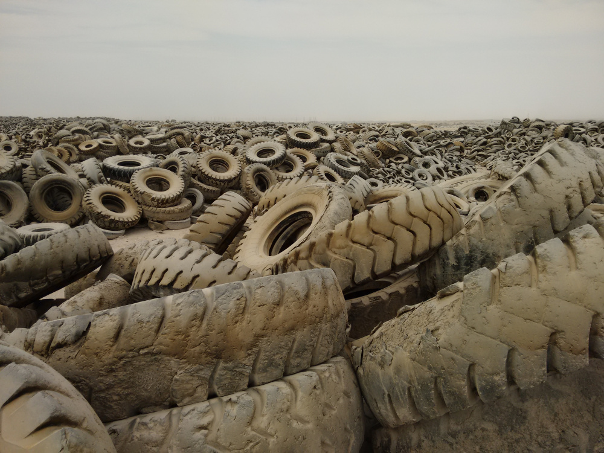

Walking. Headphones connected to the screenie. Not surpringly, I listen to Code 46's soundtrack. The heat is mild, the sun has set a few hours ago. I cross avenues of smooth tarmac and fast cars, exploring mentally the map that I avoid consulting in my pocket. Some families stroll through the park that borders the coastline and this still causes me some estrangement. Not the families themselves, except perhaps by the time of day. But it's the park itself that has a kind of unreal touch. Only in volume of water - desalinated, it is good to remind - these thousands of square meters of grass should consume more than entire regions of the Brazilian semiarid. Not to mention energy, tools and work. But here everything is like that.

We are on the border between sea and desert. But the city does everything to hide it. One secret among so many others. On my way, some clues - human trails in this place almost devoid of historical records. A magazine and a helmet next to an open manhole cover. The abandoned grocery cart turned sideways on the curb. A pair of working boots leaning against a low wall. The gap in pavement tiles, reminding us that there are just a few centimeters separating this almost scenographic city from the infinite sand.

All this artificial setting, a gigantic construction site with bright & cheery buildings throwing lasers to the clouds, new avenues and shopping malls are, in practice, produced with human hands and abilities, and the construction here is far from being over. People building a country that is not theirs. Neither is it for them, in a deep and explicit way.

I was invited to spend two weeks here as a resident at a university. I'm working with ten students of the master's degree program in design. They are brilliant. Eight are women who moved here in search of wider horizons of study, still rare in other Arab countries.

The residence is about gambiarra and repair culture, a theme that in this place sounds strange. Qatar is a rich country whose current shape was built in an accelerated way, with resources coming from the exploration of natural gas. VCUQ, my host, is actually an American University (Virginia Commonwealth University) that has a unit here in Doha. It is headquartered inside the "City of Education," a local government initiative that has set up five U.S. universities here on a modern campus. Most teachers are European. They have fully equipped laboratories, a materials library (hundreds, thousands of samples?) and a very complete and pleasant library.

The former king, who had abdicated in favor of his son a few years ago, already knew that the production of natural will eventually be exhausted. He set out to create alternatives ensuring that, in the space of a few decades, the economy won't depend on it alone. He invested - sometimes in a very caricatural way, but still significantly - in media, technology, tourism and other areas. His wife has created an educational foundation that funds projects around the world. But the country still has pretty particular characteristics.

People here don’t pay taxes, and local citizens (about 15% of the current population) have free education and healthcare. The workforce for less skilled activities comes from Southeast Asia. High-level technical and administrative positions are usually occupied by Europeans and North Americans, exception apparently made to the gas extraction sector which seems to be the favorite of talented young Qataris.

Combining a very high purchasing power and a low level of cultural rooting or even affection between society and territory, the result couldn’t be different of a consumerism that reaches obsession.

A student reported that what shopping was the biggest form of entertainment. That did not surprise me, as didn't differ much from the lifestyle of many people I know in São Paulo. In Qatar, however, everything is superlative. People buy a lot, even if they use very little. Consequently, things are compulsively discarded.

My destination today wasn’t the central market, recently reshaped for tourism, nor some of the international museums housed in buildings signed by famous architects, or even one of the international hotel bars where alcohol is allowed. I actually went to a hypermarket at a shopping mall, to buy credit for my screenie and snacks to eat when I run out of the guaranteed meals at the hotel.

The mall annoyed me less than anticipated. It was much like similar places in Brazil, except for the huge ethnic/national and clothing diversity. Curiously, we lose by far on this topic. On the other hand, it also had the ice-skating rink, international brand shops, fast food, and other familiar things in this homogeneous and tedious mall culture. But I've seen lots of shopping bags, and I can’t stop thinking about the fate of all those things.

By the start of my residency, I talked with the students about trash, waste and reuse. I've shown some videos: Ilha das Flores; The Lightbulb Conspiracy; some excerpts from Extraordinary Waste; Digital Handcraft. One student commented that here people just throw things away, but after he thought a bit about it, that "away" does not exist.

This is not a new idea, but here it becomes even more radical. In Qatar, to throwing things away means sending them to the desert, or to a potentially contentious sea. One of the teachers told us that the country had built a plant to recycle various materials with the most advanced equipment their gas money could buy. But it was never put to work because there is no local market for recycled raw materials (as there is no local industry). And exporting recycled materials by sea would not be worth it. Result: the recycling plant itself was also left in the desert to disappear.

In general, the entire group of students was aware of issues about the environmental impact of industrial production and the contemporary world economy. But even as a reflection of the dynamics of local society, that was not a priority in the work of any of them. To focus on these issues, we decided to do a short field experiment. For a couple of days, we will be visiting professionals working on repairs and craftsmanship: tailors, carpenters, watchmakers, shoemakers. We will also go out looking for cemeteries of cars and tires, located in the middle of the desert. Finally, we will do two days of Repair Cafe on campus, drawing attention to these issues and creating an opportunity for the students to get some hands on time.

As I walk my way back to the hotel, a slight anxiety emerges. I am trying to find out to what extent gambiarra makes sense as a mix of tactical creativity, disobedient solutions to everyday problems and building different (and better) futures. I look around once more, take a deep breath and dissolve inside my headphones. I see one more of those scenes that remind me of the human nature of all the work done here: a glove, alone on the sidewalk. In this place, I think gambiarra will always occupy a subordinate place. Hidden, unwanted, unrelated to decision mechanisms. But it is indeed there. And it must spread throughout the world, more and more.

---

_This text was originally published in the 4th edition of Facta magazine in Brazil. The portuguese version can be accessed [here](https://medium.com/@felipefonseca/gambiareia-a3c7f6156bfe) _