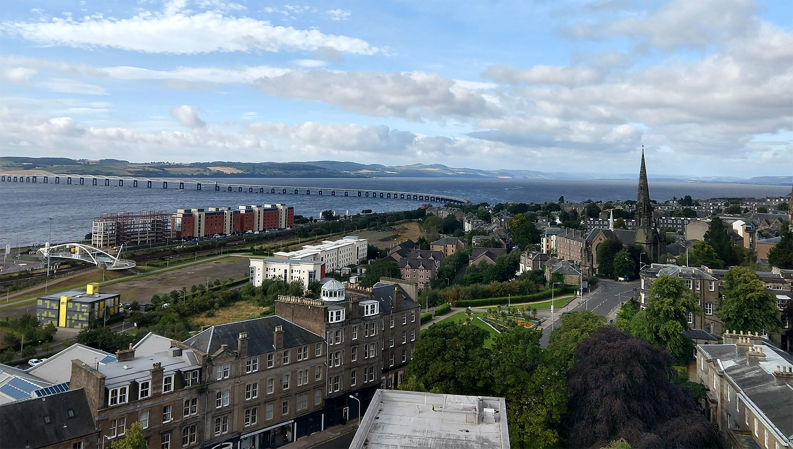

In the context of the [OpenDoTT project](https://opendott.org/) which advances the understanding of open design seeking to develop a more trustworthy internet of things (IoT), the specific topic of [my Ph.D. research](https://is.efeefe.me/opendott) is that of the so-called Smart Cities. Since I arrived in Dundee last July I was able to get a taste of a wide range of critical takes on the field, reflect upon some common elements between them and how they relate to my own past experience, as well as learn about areas I want to explore further.

My starting point was, in fact, a hiatus of about a decade. Around 2009 and 2010 I have written a bit about smart cities, albeit very superficially and only in Portuguese. My main interest was not technology in itself, for I already felt the deployment of information systems and hardware in cities was arguably nothing new. From public lighting to policing and transportation systems, cities have often been the proving grounds for new technological developments, since way before the digital appeared. I was rather more interested then in understanding the potential role of experimental labs when associated with emergent urbanism and local communities.

After writing those first texts, though, my attention was driven to other directions as I committed myself to a series of projects over the next years. Meanwhile, the role of technologies in society and politics has changed substantially. Just think that in 2010 there was no WhatsApp; few people knew about Wikileaks, nobody could foresee what Snowden and Manning would reveal; and far-right politicians still laid at the fringes of representative democracy. 

Upon starting my Ph.D. research I felt then the need to read a lot, if only to get up to date with recent developments. I also felt I needed (and to be honest still do) to acquire a wider understanding of scholarship about the thousands of years of urban development, and to gain insight into how that relates to digital technologies. One of my first clues was a short pamphlet that I had intended to read since it was out in 2013, but never had the time to do so. In [Against the Smart City](https://www.goodreads.com/book/show/18626431-against-the-smart-city), [Adam Greenfield](https://en.wikipedia.org/wiki/Adam_Greenfield) exposes how the mainstream narrative around smart cities was manufactured intentionally by big IT vendors willing to sell their services and equipment to municipalities - often similar to services and equipment they were already delivering, but for a premium; that said narrative is based on a very hollow understanding of what a city is or should be; that some of the most widely used examples of smart cities are in fact artificial urban sections built from scratch with no genuine urban life; that they often aim at a supposed increase in productivity and efficiency, but those are very hard - likely impossible - to measure; and consequently that those famous cases of smart cities are much more mobilized as PR stunts to legitimize retrofitting every other city than honest experiments with new ways to organise urban life in those locations all while throwing more public money onto private corporate suppliers with little democratic oversight.

For some years after exploring the shortcomings of the idea of a smart city, Greenfield went looking for alternatives. His [Practices of the Minimum Viable Utopia](https://speedbird.wordpress.com/2014/04/17/what-im-working-on-lately-practices-of-the-minimum-viable-utopia-long/) saw value on emergent urbanism, community workshops and local making, while later in [Radical Technologies](https://www.versobooks.com/books/2742-radical-technologies) he would go further on the potential uses of technologies such as blockchain and digital fabrication equipment to support meaningful political change. In the process, though, he would give up on smart cities altogether and is reportedly treading other paths nowadays whilst still interested in cities, democracy and change.

Alongside Greenfield, many other authors have been contributing to understanding smart cities from a critical lens. Around the first month after I moved to the UK, a friend who’s a researcher on Latin American studies and decolonization suggested I had a look at the work of [Ayona Datta](https://ayonadatta.com/). In a series of interesting pieces, Datta tries to bring the perspective of non-western urban environments to the discussion about smart cities, engaging with Indian and South African contexts, as well as more recently bringing to the fore the potential implications in small towns too. Her work weaves, on the one hand, an ethnographic approach with eyes and ears on the field, and on the other an incisive reading on the political aspects of urbanisation and how power relations are represented in it - not only at a local level but regional and transnational as well.

## Beyond Smart Cities

Ayona Datta was also one of the keynote speakers in the [Beyond Smart Cities Today](https://ayonadatta.com/) seminar [I came to attend](https://is.efeefe.me/opendott/beyond-smart-cities-today) in Rotterdam last September. As well as her own work, I had then the opportunity to learn about other interesting researchers. Many among them were speakers at the seminar, as well as being featured in a book recently edited by [Rob Kitchin](http://www.kitchin.org/) and [Paolo Cardullo](https://kiddingthecity.org), [The Right to the Smart City](https://www.emerald.com/insight/publication/doi/10.1108/9781787691391) (a play with [Henri Lefebvre](https://en.wikipedia.org/wiki/Henri_Lefebvre)’s well-known “The Right to the City”). Those days turned to be a good crash course on the critique of the smart city. I was put in contact with a number of works questioning the lack of agency of local populations about smart city projects, as well as issues of surveillance and privacy, ownership and the often intimate relationship of local authorities and the interests of transnational corporations.

The extent to which a significant part of the conflict arising from smart cities is tied to such a fundamental issue as land use regulation and the governance of private-public partnerships was somewhat disappointing to my own illusions around the smart city. It felt in fact surprisingly similar to what we found while running Ciência Aberta Ubatuba, a research project initially interested in promoting open and collaborative practices amongst researchers and scientists working in a particular area of Brazil, but which ended up trying to contribute precisely to promote wider access to the discussions about land use regulations. Not a new subject to me, in that sense.

During one of the last sessions of Beyond Smart Cities Today, Rob Kitchin noted that the participants had been discussing smart cities for those three days, but very little was explicitly said of, and I paraphrase, capitalism, labour and value creation. In something of a parallel to that perception, it indeed feels to me that all the discussion about smart cities is only concerned with what people do before they get to their workplace, or after they leave - public transport, lighting, options for entertainment and leisure, access to public services and play areas. Sometimes even housing, education, and healthcare. But little is said about work itself. As if citizens are not workers.

Again from Rob Kitchin, this time in his own keynote during the conference, I have learnt about [Francesca Bria](https://en.wikipedia.org/wiki/Francesca_Bria)’s and [Evgeny Morozov](http://www.evgenymorozov.com/)’s [Rethinking the Smart City](http://www.rosalux-nyc.org/rethinking-the-smart-city/), published in 2018 by the Rosa Luxembourg Foundation. Despite having been reading a number of articles written by Morozov in the last couple years, and being acquainted with Francesca since the days of the Bricolabs network, somehow I had previously overlooked that work. The book interestingly makes the point that the smart city is precisely the stage of reproduction of neo-liberalism:

> “it seems to be the case that technological infrastructures configured in a fashion more in line with the dogmas of neoliberalism—e.g., which treat data gathered in the city as a commodity to be bought and sold on secondary markets, delegating a greater share of public transportation to firms like Uber and taking a more hands-off approach towards the likes of Airbnb—will make it rather difficult for cities to experiment with non-neoliberal political and economic agendas.”

Later on, Bria and Morozov propose that building on the idea of technological sovereignty - a term first circulated, it seems, from within [autonomist and anarchist circles](https://wp.sindominio.net/blog/soberania-tecnologica-volumen-2/) and encompassing a number of experiments around free/open source technologies, local manufacturing, and degrowth - would be a first significant step in overcoming the neo-liberal dead-ends. Rethinking the Smart City lists examples of local administrations facing the immense power of venture-funded transnational corporations by trying to shift from market-oriented urbanization to approaches oriented towards the public good.

## Unfolding the map

Those three or four leads opened my eyes to a diversity of meaningful research and literature done in recent years. Only on smart cities and other urban issues, there are a couple dozen books, articles and papers I plan to read in the coming months. The list can keep on growing indefinitely as new works appear, as is natural. To mention just two of the most recent ones that caught my attention: [Some Thoughts](https://some-thoughts.org/) and [How to run a city like Amazon, and other fables](https://shop.meatspacepress.com/product/how-to-run-a-city-like-amazon-and-other-fables). 

The former stems largely from the opposition to Sidewalk Toronto. I must confess I was not following that project before starting the Ph.D., but many people drove my attention to it since, not least [Bianca Wylie](https://biancawylie.com/), who was also a keynote speaker in Rotterdam and is one of the key people resisting in Toronto. The project seems to be the new shining utopia of the smart city canon, updated with a little hipster-greeny dressing. For research purposes, I have listened to some episodes of a podcast made by Sidewalk Labs, the project’s developer. I feel that the people who host and participate in the podcast sound as they even believe to be taking on the establishment (the automotive industry, for instance, or the construction sector). More important than whatever they say, however, are the many issues they do not address. To what extent their blindness to the corporate interests behind their own organisation (backed by Alphabet, which itself owns Google, no less) is either ignorance or cynicism remains to be discussed. Against that, Some Thoughts offers many quick entry points to deeper discussions and that way highlights important ideas and initiatives in the smart city space. 

In a different approach to similar matters, How to run a city like Amazon explores “how a city might look, feel and function if the business models, practices and technologies of 38 different companies were applied to the running of cities”. It features speculative or otherwise exploratory essays, flirting with cyberpunk and dystopic storytelling and as such can contribute to the discussion in ways that go beyond the mere naturalisation of new technologies and key points of neoliberal ideology in the urban environment.

## Focusing

In any case, up to now, I have read a part of those books and articles on smart cities and urban issues in order to understand what the perspective of my research must be. And I will be focusing next on one particular subject, for a number of reasons. First of all, I understand that a general critique of the smart city is already being well concerted, and for now, I wouldn’t have much to contribute significantly to it apart from closing ranks against the ill consequences of digital-driven transnational capitalism. Even if the smart city is still making headlines on specialized news and being promoted by IT vendors to maximize their businesses with vulnerable officials in cities of all sizes, the groundwork is laid to understand how problematic that image is. I do however see a gap in most of what I have read to date.

I am naturally aware of the risks of bias, as the proverbial hammer for whom every problem is a nail head, but I know as well that one needs to value their past experience to understand current challenges. It is then expected that my eyes will pay attention to an area I have been involved in and out in the last couple decades: waste management. And from what I read so far, I do see it mentioned briefly within smart city materials, but usually only in introductions sections. That is, whenever people try to explain what smart cities are about, they will say something about cities trying to use IT in order to better manage transportation, lighting, security, and... waste. There it is, indeed, mentioned quite often. But as the works unfold, the smart city may be criticised for its own blind spots that increase inequality, undermine democracy and put us all under permanent surveillance. Some will even start proposing alternatives, escape routes, ways to say no and create different settings for contemporary urban life. But at that point waste is absent from the conversation. It may be mentioned anecdotally - some rightly dismiss the deployment of “smart bins” as useless or outright nonsensical. But the whole discussion about capitalism, labour, inequalities, sovereignty... is apparently unrelated to whatever mechanism is generating and disposing of waste. And to my understanding that view must be challenged.

It is as though compared to issues such as social participation, agency and inclusion, waste dissolves (literally?) in the background, seen as nothing more than an unsexy technical-material ensemble only interesting to engineers and perhaps some environmentalists. After all, isn’t society already moving forward as more citizens start sorting their recyclables all over the world?

It turns out it is not. And that requires me to dive into literature and insights from a whole other area, as well as recollecting projects I’ve been involved with in the past couple decades. But I’m keeping that for my next blog post. Meanwhile, check how [waste and scraps](https://is.efeefe.me/opendott/waste-in-my-life) entered my life, back in the last Millenium.

===

_This text was first published in the [OpenDoTT website](https://opendott.org/posts/city-mattering/). To add comments, please check the [Medium version](https://medium.com/@felipefonseca/city-mattering-8f27a5e8c90e) or [the Linkedin one](https://www.linkedin.com/pulse/city-mattering-felipe-schmidt-fonseca/)._
