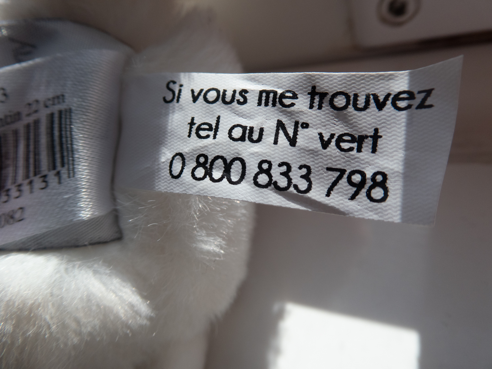
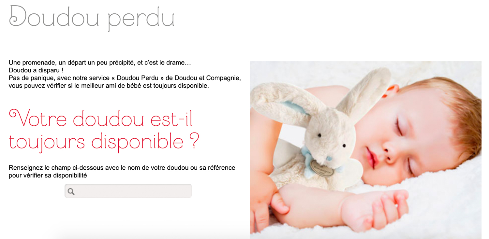

One of these days I went out for groceries and decided to turn my way back home into the allowed outdoor exercise hour. I was on the [free bike](../free-bicycle-diary-part-1) and took a longer path back.

Right before crossing the Riverside Drive to get to the bike path by the Tay, I saw a dancing unicorn. A plush one, I mean. As I waited for the traffic lights to open, I considered whether I should do anything about it. It felt to me as if some family passing by would have dropped it and would eventually come back to retrieve the missing doll.

The cars stopped and I went on towards the river, mind suddenly focused on a recurrent research issue: what is to be done with misplaced but still useful things in contemporary cities? I thought of the very bike I was riding, and about the experience I had in Barcelona more than a decade ago, of going out in our neighbourhood on Thursday evenings to collect useful things discarded by other people: furniture, books, appliances. 

Still riding the bike, I tried to start recording an audio note contrasting the already criticised “smart city” with a loose idea of a “generous city” I could get back to later on. As I realised the strong wind could not only interfere with the audio quality but offer the danger of making me lose balance on the bike, I decided to stop by and jot down ideas (pause to advertise the excellent open source note-taking app I use, [Joplin](https://joplinapp.org).

> **Generous city**

> A dancing unicorn on the sidewalk. Bike. Barcelona.

> Train station

> Where will it end up?

I decided then to get back and observe the unicorn (not completely untouched by the symbology of unicorns in Scotland) as it was arguably eliciting interesting insights for my research. Fortunately I had my camera on me.

I spent about ten minutes only watching the ballerina-dressed unicorn perform its strange dance. As anyone who lives close to large bodies of water should be aware, there is a huge chance that anything left outdoors will be carried by the wind to the nearest river and then to the ocean. 

As nobody came to retrieve it, I put it on the bike’s saddle and took it home. I was still thinking of how one could frame future cities as essentially generous ensembles that would offer gifts to citizens. I might have been impacted by recently watching - again - a video of then Brazilian Minister of Culture Gilberto Gil trying to reconcile two different perspectives about digital technologies and how they would relate to a then envisioned “gift economy”. Granted, it was 2003 and very few of us would ever dream of the ill effects of digital messaging and platform capitalism. But abundance and generosity are still part of what society should be based on, to my understanding. 

On the other hand, that was not the case of that Unicorn. It didn’t seem to be something discarded by others and gifted to me. Instead it looked as though it was lost and someone (a child?) would be missing it. Was there anything I could do about it? I thought of taking it to the Railway Station and ask whether they had a lost and found service. But would the family that lost the unicorn even think of walking into the station to ask about? Or would there even be any such service working under the current lockdown measures? I ended up taking it home for the time being. Not as a gift to my kids, rather a research object.

In the present state of the world, I felt like adding some extra measures for the sake of health and safety. First thing I did was sprinkling a bit of a disinfectant that claims being effective against bacteria and viruses. However, I did not want to get it too wet and the amount of disinfectant I used was probably not at all useful. Adding to that, I left it under quarantine in a spot where it is exposed to sunlight every afternoon. I’m not sure how long I should keep it untouched, though. One week? Two? Am I being paranoid?

Inspired by some of the interviews I did for my ecosystem mapping, I figured the first thing I should do was to get it cleaned up. As I tried checking the tags sewn to its side to find if they mentioned cleaning instructions at all (yes), I found interesting information. First of all, its origins. _Doudou et Compagnie_ is a French brand. The internet comes to help. Apparently, this thing has a retail price of about 20 Euro, give or take. But the value of a doll is seldom related to its price, right?

Would it belong to a French family visiting Dundee? If it was lost recently, that is unlikely as all tourism is supposedly halted due to the COVID-19 restrictions. It may be that it was lost by someone who live in Dundee. Perhaps it’s been around for longer - months being carried by the wind, dancing over hundreds of miles of Scottish landscape. Not likely, but I’m instantly reminded of the traveling gnome sending Postcards to [Amélie Poulain](https://en.wikipedia.org/wiki/Am%C3%A9lie)’s dad.

Another thing I learnt from the tag was its name: it is called Licorne, 22cm. But then there is another tag, even more interesting to me: _si vous me trouvez, tel au N. vert_ followed by a 0800 number, apparently French. Meaning, “if you find me, please call this phone number”. On the back it has what seems to be an unique ID number for this particular doll.

Not willing to make an international call in a language I’m poorly skilled at, I tried their website. Good, they have a [page for lost dolls](http://www.doudouetcompagnie.com/11-doudou-perdu). But from all I understand, it’s not possible to inform that I found a Doudou. Only to look for a missing one. That’s odd, but I sent them a message and will update this post as they reply:

> Bonjour. I'm sorry for writing in English. I live in Dundee, in the United Kingdom, and recently I found a lost Doudou. I see the tag with a phone number to inform I found it, but found no way to do it here on the website. It is a 22cm Licorne. Can you please add it to your lost Doudou database? I would be happy to return it to whoever lost the Licorne.

Whenever I remove it from the quarantine, I’ll proceed with the cleaning. Unlike the research objects in my repair diaries, the Licorne needs no repair at all, but in the case I found its owner, they will be happy to have it returned tidy and safe. Apparently, using baking powder in a plastic bag is a good way to get this kind of thing cleaned up.

Meanwhile, I’m thinking whether it would be relevant to explore ideas of a city-wide lost and found service, and if so whether an open/commons approach would help. Or am I biased and trying to put too much under my research topic? Then again, can we explore the idea of a generous city rather than (or in addition to) a smart one?