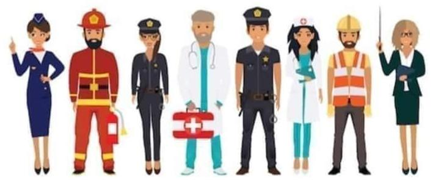

*As mentioned elsewhere in my research blog, I have been using an audio recorder to document musings while in voluntary confinement. Here’s an edited (and expanded) transcript of some of these recordings, made some days ago. It does not necessarily lead to coherent thinking. Rather, I see it as a way to anchor insights to a particular moment and eventually free my mind to move on. If anything here is really relevant in face of this radically changing world, I might come back to it in the future.*

The current events bring memories to the fore, and it may be relevant to weave them both in my understanding of the near future as well as in my research. One of them is a somewhat fuzzy recollection of a change of context. The other, an indirect account of things that happened to close friends and relatives.

I was fourteen when I moved from Porto Alegre to Rio de Janeiro with my dad. He had spent the previous four years heading the public company providing IT services for my birthplace Porto Alegre. In that period I was being indirectly taught a lot about politics and change, power and participation, technology and public good. My dad eventually left the public sector for good, and started working for the Rio de Janeiro office of a large vendor of IT services for even larger corporations. I joined him in Rio, and found myself in a city too big and messy to grasp.

It was my second time there, and I knew nothing of the city and its dynamics. Of the social segregation and the welcoming people. Of the curious mix of an authoritarian and a relaxed culture. Of late manifestations of colonial power and a pretty active creative sector. Of the contrast of pretty safe and the dangerous zones. A strong impression I keep to myself, and which is important here, is of walking the streets of Arpoador soon after I arrived. Arpoador is a neighbourhood connecting the famous beaches of Copacabana and Ipanema. I remember it as middle-to-upper class, and I’m sure many will disagree on that opinion to either side. In any case, part of what I do remember is that those streets stank. That is curious, as my sense of smell is quite weak. Either I made up a memory because someone else made sure to notice the smell, or it was really strong. I had heard about cities stinking - Recife for its muddy rivers, Cubatão for its industrial complex, São Paulo due to pollution. Even in Porto Alegre we would every so often smell the cellulose industry from across the Guaiba estuary. But 

The reason for the stink was visible: garbage was piling up on sidewalks. According to these partly made up memories of mine, that was happening as a result of the garbage collectors being on strike. There might have been elements of the ongoing conflict between progressive politicians, the all powerful right wing Globo news corporation and possibly local mafias. I won’t go looking for data to confirm or refute that impression, though. What’s important is the realisation of how much waste was generated every day, and what happens to it when exposed in a particularly hot city during summertime. It felt like chaos just around the corner in that huge and incomprehensible city.

I had come from a much smaller place in comparison. Porto Alegre had its own issues, but at least there had been some efforts in trying to implement the separate collection of recyclables. I had watched [Ilha das Flores](../ilha-das-flores) at school. And now I was in Rio, the same city that had hosted the international ecology conference Rio 92 only the previous year. And there it was, stinking badly of fermenting waste.

I can’t help thinking of an old joke about body parts and the relative importance of the intestinal functions (here’s a bad tasted - be warned - [version in English](https://gregferro.com/joke-when-the-body-was-first-made-who-was-the-most-important/)). I’m not particularly interested in going too scatological, but there may indeed be a connection of the unease people have discussing waste in the city with the way contemporary humans deal with the waste their own bodies generate. On the other hand, many languages do have expressions that recognise the importance of such functions. We have a gut feeling. We need to have the guts. We can sometimes act - and create - viscerally. 

Ancient traditions talk about three intelligences - mind, heart, guts. The latter is more earthly than the others - connected to soil, survival instincts, basic functions, nutrient exchange. And here lies one important aspect. Moving back to thinking of waste in urban settings - can we interpret waste as the materials left when their nutritional value is extracted? Building on that metaphor, developing the gut intelligence of a city could be translated as improving its ability to absorb nutrients. Improving the ability to absorb and distribute nutrients might as well mean wealthier - and healthier? - cities. Or cities that require a smaller volume of material input, putting less pressure into industrial production. That feels timely under the current horizon of scarcity coming almost unprecedentedly from the supply side.

For the time being, I’ll put that train of thought aside, for it is in line with other ideas I have already posted about. But I’d like to focus on the waste collection service itself. Among the hundreds of memes most of us have been sharing like crazy in these weird times, one has caught my attention. It says “we can not stay home, but you can” and has illustrations of professions such as a flight attendant, doctor, police, firefighter and others. There is one guy with gloves, helmet and a reflective vest that seems to represent manual workers, perhaps ones involved in road maintenance and the like. No sign of the waste collectors, though. Naturally, this is not an extensive or even that intentional account of the priority of societal roles, which are significantly more numerous than half a dozen. But as my radar is set to this topic, the invisibility of waste for what is understood as basic functioning of society is notable. What would happen in the extreme eventuality of cities being unable to collect and process waste? I have seen a glimpse of it in Rio in the nineties. And had an indirect experience years later as well.

Ubatuba, the place I lived for a little over a decade before moving to Scotland, is a natural haven. It has tens of amazing beaches, rivers and waterfalls. Its beauty is to a great extent a consequence of its preserved areas. Four different protection zones crisscross the area, both in the exuberant Atlantic Rainforest and the ocean.

It turns out the landfill the city had been piling up waste in since forever was eventually exhausted and deactivated in the first decade of this century. Due to its special status in between environmental protection areas, it is almost impossible to license any operations that are potentially toxic - such as handling waste. Since then, Ubatuba started exporting all the waste it collects. I understand this is an usual term, but can’t avoid noticing the curious effect of words. To a general public, “exporting” may sound positive, as if the city could be profiting from that. Quite the opposite, the city spends hefty amounts of money every month to sweep its dust under the carpet. 

Every day, plenty of lorries take waste hundreds of kilometres through narrow, sinuous roads in the middle of the forest - leaving a trace of carbon monoxide and the unmistakable stench of waste on the way. The city does little to reduce the generation of waste, despite brave attempts from one or two public servants over the period. There was a hopeful attempt of developing and approving a strategic plan for the integrated management of solid waste, but the city had no resources to implement it. In recent years, it has gotten worse as the political context in Brazil is being headed by a gang of science deniers who dismiss environmental concerns (as well as social ones), and it echoes in Ubatuba both in terms of funding and vocabulary. The upcoming economic downturn may turn that into a real crisis. And there was a trailer of that, over ten years ago.

The final days of December 2009 brought heavy rains to the region. The kind of rain that makes that type of forest be called “rainforest” in English. Being in Scotland right now, I imagine it may be even hard to picture what a heavy rain is in Ubatuba. I remember once reading news that - but won’t be sure it was a fact or only journalist hype - it rained 180mm in a single day. It is more than Dundee gets on average in its wettest month, according to [Wikipedia](https://en.wikipedia.org/wiki/Dundee). Never mind the millimetres, as the new years eve approached the city was hit with a lot of water.

The most usual effect of that much rain in the region is flooding in low areas, usually around rivers over whose original banks cities and houses were built. Another effect, still to be expected but not nearly as common, are the landslides. The amazing landscapes of Ubatuba are composed of a seaside mountain range covered by forest. All those mountains have a base of stone, on top of which are some meters of rich soil. Intense rains add to the weight of the ground and make it start sliding, taking rocks, trees, animals, fences, houses and whatever else is on the way. Well, as 2010 arrived, the landslides blocked all three roads that connect Ubatuba to other cities.

I was not there at that particular time - but suffered the effects of the rain in another place. However, friends told me of the many implications the blockage of roads had in everyday life. One of the worst was the disruption in waste collection. There was nowhere to take it to. The city was, as usual in that part of the year, crowded with tourists, most of them eager to use the little days off they have. They kept on buying and using things, and generating lots of waste. In some parts of the city, there were bags of waste floating amid flooded streets. People had to keep their waste indoors, and many report having to deal with rats and cockroaches after a few days only. 

The situation was normalised, as it were, after the roads were cleared. Still, I am still conscious of how quickly the disruption has impacted people’s lives. And how quickly the city forgot about it afterwards. The sense I get, to use an image sadly common in the region, is that even if people were annoyed by being aware of a particular piece of trash lying in the sand, they were relieved once the tide came in and took it away. As usual, we need to ask: where is that “away”? 

[plugin:youtube](https://www.youtube.com/watch?v=squ_k6mm8yQ)

Sanitary crises resulting for deficient waste collection are all but uncommon in many parts of the world. I remember images of a river of waste somewhere, perhaps in eastern Europe. And reports of the involvement of mafia with waste collection in southern Italy. Not to mention the many many awful situations in Latin America, Africa and Asia. I hope the effects of corona won’t make those episodes even more widespread. By the way, will society be generating more domestic waste now that everyone is home? One would expect that a declining economy would directly decrease the generation of waste. However, as governments pour money to ensure people keep buying, even that effect can arguably be transformed. And will consumers require extra layers of packaging, aware of the potential contamination as goods are transported? To the other end, by the way: what measures will need to be put into effect for the workforce directly involved with waste handling? Will the sorting of recyclables require new protective gear? Will new equipment be developed and deployed (and how, with a shortage on the supply side?).

In contemporary western societies, waste management is naturalised as part of everyday life. However waste itself is often invisible. It is expected to be invisible. To what extent the unwillingness of public opinion to deal with its own waste hinders the development of solutions that would make us spend less energy dealing with it is a valid question. The fact that waste collection is not usually recalled as an essential public service is potentially becoming an important part of my research, and the corona age may be making things more explicit. Perhaps it’s necessary to remind people that waste containers may become vectors of contamination. After all, even when you have delivery drivers bringing your food and groceries in, so far nobody talks about door to door waste collection. 