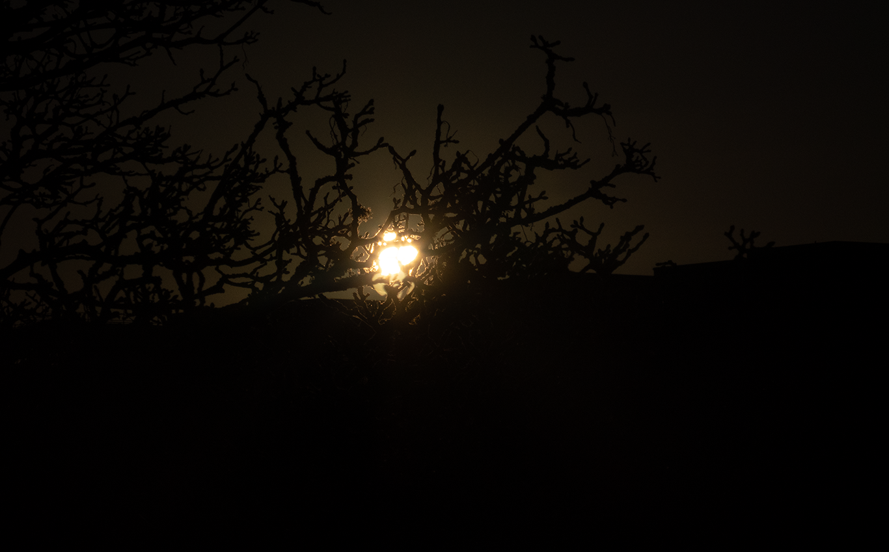

At this moment, everywhere in the world, immense pressure is being put over services such as the public health system, utilities and the production of essential goods such as food, medical supplies and protective gear. As usual, I have been thinking about the other end of industrial production. As usual, I use my own memories of past episodes to reflect upon the present. I’ll be sharing these thoughts in [my research blog](https://is.efeefe.me/opendott) as often as possible under current circumstances. I won’t be paying much attention to detail and good writing, so anyone interested please bear with me and focus on what matters.

---

*The following was originally intended to be only a paragraph to introduce the transcription of some audio notes I made during this week, but seemed to take life on its own. The transcriptions will come later, but I felt like posting this part already*.

Today is the 20th of March. Equinox is around the corner. The zodiac year comes to an end, indicating a time of hope and reconstruction. In ancient times, the imminent arrival of Spring was the only way to cope with harsh winters. Here’s hoping.

I’ve been voluntarily distancing from social life, along with my two kids, for five days already. As far as we can tell from the window of our living room (or from the occasional bike ride, or playing in the park in a beautiful sunny day), the pace of change in Dundee is still slow if compared to other parts of Europe. If the experience of our friends in Madrid is a good measure, we’re about to face hard times here as well. Society should be more and more confined, the economy will be shattered, and the very idea of a social life out of home will be a memory only.

International leaders (a category in which I obviously do not include the Brazilian dangerous clown-in-chief) have compared current times to a war effort, the worst since the Second World War. The concept is a little abstract to me, having no direct experience to learn from it except accounts by relatives of friends who had to flee Europe during or after the war because of their ethnic background. Even then, it was decades before I was born, and my own ancestors lived in the extreme south of Brazil - coping with the economic effects of war but thousands of kilometres away from the front. Their experience of the war was then mediated by newspapers and radio.

Like millions in my generation, I have naturally watched loads of movies about that time - which is also a mediated, hence indirect, relationship. However, I can imagine that most people’s experience of the war back then was also through media. Yesterday I caught myself neurotically listening to podcasts as the day went by, expecting to hear good news that won’t come that early, and suddenly was reminded of the image of people sitting around the radio, with the same hope. Some years ago I taught a course on web radio streaming that featured a short module on the history of radio as a medium and language. Among the examples I would use to show the power of audio broadcast throughout the 20th Century was the famous “[A Sterner War](https://archive.org/details/Winston_Churchill/WU400330_WINSTONCHURCHILL_0019_A_STERNER_WAR.mp3)” address by Churchill, which might be useful listening to as Spring comes and we’re required to season our hope with caution and endurance.

Much more humbly, I have been resorting to an audio recorder to capture some thoughts of my own during these hard times getting harder. I won't be publishing the original recordings, as they are only an unarticulated and bilingual attempt to put order to insights coming all of the time. But, in a sense, talking to myself seems to be a good way to understand these thoughts. I'll post the edited transcriptions later, hopefully still today.