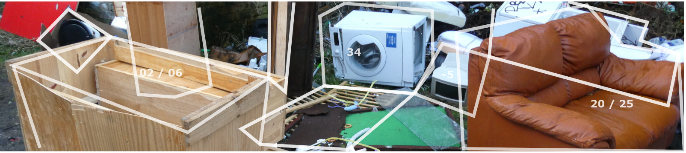

# OpenDoTT
## Waste Avoidance in Smart Cities

I am Felipe Schmidt Fonseca, a researcher at [Northumbria University](https://www.northumbria.ac.uk/). At the time of publishing this page (August 2020), I'm working on [design concepts](#design-concepts) that respond to insights on [data](#research-data) collected during my [first year of research](../opendott/research-progress) in the [OpenDoTT](https://opendott.org) project.

A video introduction is available from the [Internet Archive](https://archive.org/download/wasc-intro/01-%20presentation.ia.mp4):

  <video width="960" height="540" controls>
   <source src="https://archive.org/download/wasc-intro/01-%20presentation.ia.mp4" type="video/mp4">
   Your browser does not support the video tag.
  </video>

The main focus of my research is to contribute with ideas for cities and towns to avoid as much as possible the very need to manage waste in the usual ways, encouraging instead the *reuse of materials* through initiatives of *repair and repurposing* aimed at and run by *local actors*. More information about my research can be found [here](../opendott/focus) and elsewhere in my [research blog](../opendott).

I have sketched eight concept ideas, <a href="#design-concepts">listed below</a> and further detailed in individual pages. These concepts and their descriptions will be edited as my research evolves over time.

I am expecting to get feedback on those concepts in order to understand their relevance and prioritise further phases of development. Please send your comments to my email address if you have it already. Alternatively, please use this one: [5wbi948e9@relay.firefox.com](mailto:5wbi948e9@relay.firefox.com).

---

## Research data

Two research studies were conducted to generate data for this project. Here is a short description of them [in video](https://archive.org/details/wasc-design-research):

  <video width="960" height="540" controls>
   <source src="https://archive.org/download/wasc-design-research/02-%20design%20research.mp4" type="video/mp4">
   Your browser does not support the video tag.
  </video>

The concepts are mainly based on data coming from two research studies:

- [Repair Journey](../opendott/repair-journey) - seven participants were invited to spend some weeks trying to repair or repurpose broken objects, and were interviewed at the end to discuss what were their challenges and discoveries along the way.
- [Ecosystem Mapping](../opendott/ecosystem-mapping) - five people whose work is related to the reuse or re-circulation of second-hand goods were interviewed to compose an overview of the field.

Additional insights, inspiration and contributions to create the concept ideas came from:

- The ongoing process of constructing my literature review - part of it documented in the [research blog](../opendott).
- Previous experience in other projects related to reuse and maintenance.
- My recent attendance of online courses on [Waste Management in Developing Countries](https://www.coursera.org/learn/solid-waste-management) and [Platform Cooperativism](https://platform.coop/blog/pcc-mondragon-university-offer-online-course-to-incubate-platform-co-ops/), and conversations with colleagues in those courses.
- Participation in events such as [Fixfest UK](../../opendott/fixfest-uk-2020) and [others](https://talk.restarters.net/t/fixfest-uk-2020-everything-you-need-to-know/2994/6)

---

## Target groups

Even though the boundaries are somewhat blurred, each concept idea connects to at least one out of four target groups identified in the research. There is some overlap between them, but each can arguably be understood as a perspective that poses a different emphasis on the way materials are to be handled and circulate:

  

  

    <h4 class="card-body">
      Citizen
    </h4>
    

     - Individual/household who has things that are broken, ill-fit, inadequate or unwanted.
    

    

     - Individual/household who is interested in acquiring trusted and affordable second-hand goods.
    

  

  

    <h4 class="card-body">
      Community
    </h4>
    

     - Group or organisation willing to offer second-hand goods to communities, or to use second-hand goods to generate income to community members.
    

    

     - Volunteer group or not-for-profit organisation organising repair cafes, clothes swaps and other zero-waste projects.
    

    

  

  

  

    <h4 class="card-body">
      Professional Reuse
    </h4>
    

     - Social enterprises working on the selection, transformation and redistribution of second-hand goods.
    

    

    - Professional workshops dedicated to repair, maintenance, customization and upcycling of used objects.
    

  

  

    <h4 class="card-body">
      Public Sector
    </h4>
    

     - City council or similar official government body looking into social, environmental and economic benefits of encouraging the reuse of materials at a local scale.
    

    

    - Regional or inter-municipal public organisations tackling environmental issues.
    

    

  

A [video description](https://archive.org/details/wasc-targeting) of these target groups.

  <video width="960" height="540" controls>
   <source src="https://archive.org/download/wasc-targeting/03-%20targeting.mp4" type="video/mp4">
   Your browser does not support the video tag.
  </video>

---

## Design Concepts

The concept ideas shown here are my responses to issues and insights identified while exploring the idea of waste avoidance in cities and towns, and how initiatives under that perspective are usually absent from smart city projects. Each concept connects differently to at least one of the four target groups.

These ideas are not meant to be radically new. Rather, the intention is contributing to build a systemic, commons-based approach that allows society as a whole to benefit from the potential value that can be generated through secondary flows of matter.

The concepts can be grouped in three main categories:

  

    <h4>
      Data and Things
    </h4>
    

      <ul>
        <li>
          <a href="concepts/universal-registry-things">
          Universal Registry of Things
          </a>
        </li>
        <li>
          <a href="concepts/point-reuse">
          Point and Reuse
          </a>
        </li>
        <li>
          <a href="concepts/save-this-thing">
          Save this Thing
          </a>
        </li>
    

  

  

    <h4>
      Transparency and Visibility
    </h4>
    

      <ul>
        <li>
          <a href="concepts/make-waste-visible">
          Make Waste Visible
          </a>
        </li>
        <li>
          <a href="concepts/reuse-dataset">
          Reuse Dataset
          </a>
        </li>
    

  

  

    <h4>
      Reuse in the City
    </h4>
    

      <ul>
        <li>
          <a href="concepts/reuse-commons">
          Reuse Commons
          </a>
        </li>
        <li>
          <a href="concepts/transformation-lab">
          Transformation Lab
          </a>
        </li>
        <li>
          <a href="concepts/reuse-bin">
          Reuse Bin
          </a>
        </li>
    

  

[Concept categories in video](https://archive.org/details/wasc-concept-ideas):

  <video width="960" height="540" controls>
   <source src="https://archive.org/download/wasc-concept-ideas/04-%20concepts.mp4" type="video/mp4">
   Your browser does not support the video tag.
  </video>

---

## Detailed concepts

Each page below shows more information about the concepts I have created with the input of participants of my research studies, as well as colleagues and supervisors. The contents of these pages will evolve as I get more feedback.
