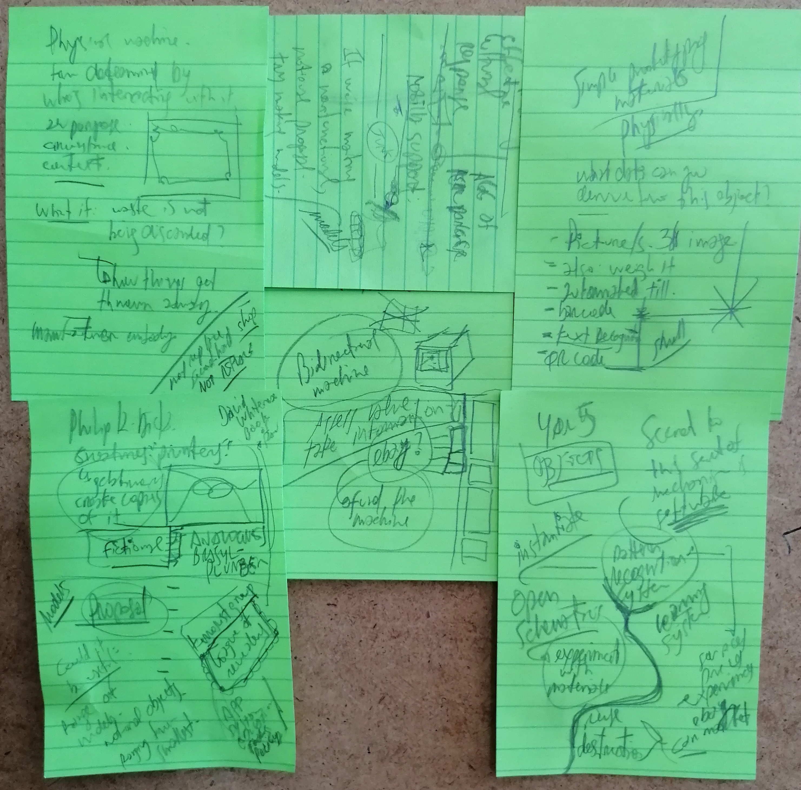

# Brainstorming

## 04.03.2021

How about a robot shaped like [this](https://duckduckgo.com/?q=LED+Light+Helping+Hands+Magnifier+Station&ia=images&iax=images&atb=v236-1)?

### Tech to assist repairs on entertainment / sci-fi:

 - Start Wars: R2D2 aiding on repairs
 - Iron Man: J.A.R.V.I.S
 - Farscape: [DRDs](https://farscape.fandom.com/wiki/Diagnostic_Repair_Drone )

## 01.03.2021

Great conversation with an artist based in Sheffield. I hope to engage him further on designing and sketching props / prototypes / models for the valudata video.

Some notes I made during / after that first call.

 - Non-functional / notional proposal. Range of Models. App, Handheld machine, Desktop/workbench, Kiosk/ATM.
 - Bi-directional machine - not only to retrieve and display (or read out loud) information, but to input about new objects as well.
 - Software is crucial. Learning system.
 - Could eBay be interested in funding this kind of technology? ;)
 - Philip K. Dick -> "printers". See things and create copies of them.
 - Book of Pages. Terrorist group - league of revealers.
 - Brazyl the Movie: plumber.
 - Cory Doctorov: Unauthorized bread.
 - Physical machine. Form depends on who is interacting with it. Purpose, circumstance, context.
 - Not to replace second-hand shops, but to help them succeed.
 - Simple prototyping materials.
 - Open source schematics (precious plastic, open source farming machines, other examples). Digital inner parts provided, the casing can be cut from diverse materials and assembled locally.
 - What data can you derive from this object?

Sensors / pattern recognition

 - Image - shape, colors, barcode, QR codes, text.
 - Weight
 - Smell?
 - Humidity
 - Hardness
 - Input via keyboard - search query
